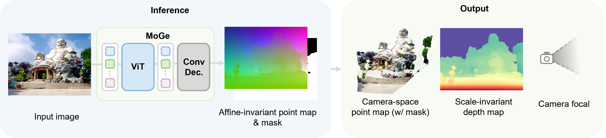
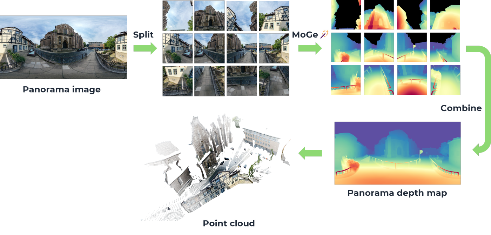

# MoGe: Accurate Monocular Geometry Estimation

MoGe is a powerful model for recovering 3D geometry from monocular open-domain images, including metric point maps, metric depth maps, normal maps and camera FOV. ***Check our websites ([MoGe-1](https://wangrc.site/MoGePage), [MoGe-2](https://wangrc.site/MoGe2Page)) for videos and interactive results!***

## 📖 Publications

### MoGe-2: Accurate Monocular Geometry with Metric Scale and Sharp Details

<div align="center">
  <a href="https://arxiv.org/abs/2507.02546"></a>
  <a href='https://wangrc.site/MoGe2Page/'></a>
  <a href='https://huggingface.co/spaces/Ruicheng/MoGe-2'></a>

https://github.com/user-attachments/assets/8f9ae680-659d-4f7f-82e2-b9ed9d6b988a

</div>

### MoGe: Unlocking Accurate Monocular Geometry Estimation for Open-Domain Images with Optimal Training Supervision

<div align="center">
  <a href="https://arxiv.org/abs/2410.19115"></a>
  <a href='https://wangrc.site/MoGePage/'></a>
  <a href='https://huggingface.co/spaces/Ruicheng/MoGe'></a>
</div>




## 🌟 Features

* **Accurate 3D geometry estimation**: Estimate point maps & depth maps & [normal maps](docs/normal.md) from open-domain single images with high precision -- all capabilities in one model, one forward pass.
* **Optional ground-truth FOV input**: Enhance model accuracy further by providing the true field of view.
* **Flexible resolution support**: Works seamlessly with various resolutions and aspect ratios, from 2:1 to 1:2.
* **Optimized for speed**: Achieves 60ms latency per image (A100 or RTX3090, FP16, ViT-L). Adjustable inference resolution for even faster speed.

## ✨ News

***(2025-10-16)***
* Updated training code for MoGe-2.

***(2025-06-10)***

* ❗**Released MoGe-2**, a state-of-the-art model for monocular geometry, with these new capabilities in one unified model:
  * point map prediction in **metric scale**;
  * comparable and even better performance over MoGe-1;
  * significant improvement of **visual sharpness**;
  * high-quality [**normal map** estimation](docs/normal.md);
  * lower inference latency.

## 📦 Installation

### Install via pip
  
```bash
pip install git+https://github.com/microsoft/MoGe.git
```

### Or clone this repository

```bash
git clone https://github.com/microsoft/MoGe.git
cd MoGe
pip install -r requirements.txt   # install the requirements
```

Note: MoGe should be compatible with most requirements versions. Please check the `requirements.txt` for more details if you encounter any dependency issues.

## 🤗 Pretrained Models

Our pretrained models are available on the huggingface hub:

<table>
  <thead>
    <tr>
      <th>Version</th>
      <th>Hugging Face Model</th>
      <th>Metric scale</th>
      <th>Normal</th>
      <th>#Params</th>
    </tr>
  </thead>
  <tbody>
    <tr>
      <td>MoGe-1</td>
      <td><a href="https://huggingface.co/Ruicheng/moge-vitl" target="_blank"><code>Ruicheng/moge-vitl</code><a></td>
      <td>-</td>
      <td>-</td>
      <td>314M</td>
    </tr>
    <tr>
      <td rowspan="4">MoGe-2</td>
      <td><a href="https://huggingface.co/Ruicheng/moge-2-vitl" target="_blank"><code>Ruicheng/moge-2-vitl</code></a></td>
      <td>✅</td>
      <td>-</td>
      <td>326M</td>
    </tr>
    <tr>
      <td><a href="https://huggingface.co/Ruicheng/moge-2-vitl-normal" target="_blank"><code>Ruicheng/moge-2-vitl-normal</code></a></td>
      <td>✅</td>
      <td>✅</td>
      <td>331M</td>
    </tr>
    <tr>
      <td><a href="https://huggingface.co/Ruicheng/moge-2-vitb-normal" target="_blank"><code>Ruicheng/moge-2-vitb-normal</code></a></td>
      <td>✅</td>
      <td>✅</td>
      <td>104M</td>
    </tr>
    <tr>
      <td><a href="https://huggingface.co/Ruicheng/moge-2-vits-normal" target="_blank"><code>Ruicheng/moge-2-vits-normal</code></a></td>
      <td>✅</td>
      <td>✅</td>
      <td>35M</td>
    </tr>
  </tbody>
</table>


> NOTE: `moge-2-vitl-normal` has full capabilities, with almost the same level of performance as `moge-2-vitl` plus extra normal map estimation.

You may import the `MoGeModel` class of the matched version, then load the pretrained weights via `MoGeModel.from_pretrained("HUGGING_FACE_MODEL_REPO_NAME")` with automatic downloading.
If loading a local checkpoint, replace the model name with the local path.

For ONNX support, please refer to [docs/onnx.md](docs/onnx.md).

## 💡 Minimal Code Example 

Here is a minimal example for loading the model and inferring on a single image. 

```python
import cv2
import torch
# from moge.model.v1 import MoGeModel
from moge.model.v2 import MoGeModel # Let's try MoGe-2

device = torch.device("cuda")

# Load the model from huggingface hub (or load from local).
model = MoGeModel.from_pretrained("Ruicheng/moge-2-vitl-normal").to(device)                             

# Read the input image and convert to tensor (3, H, W) with RGB values normalized to [0, 1]
input_image = cv2.cvtColor(cv2.imread("PATH_TO_IMAGE.jpg"), cv2.COLOR_BGR2RGB)                       
input_image = torch.tensor(input_image / 255, dtype=torch.float32, device=device).permute(2, 0, 1)    

# Infer 
output = model.infer(input_image)
"""
`output` has keys "points", "depth", "mask", "normal" (optional) and "intrinsics",
The maps are in the same size as the input image. 
{
    "points": (H, W, 3),    # point map in OpenCV camera coordinate system (x right, y down, z forward). For MoGe-2, the point map is in metric scale.
    "depth": (H, W),        # depth map
    "normal": (H, W, 3)     # normal map in OpenCV camera coordinate system. (available for MoGe-2-normal)
    "mask": (H, W),         # a binary mask for valid pixels. 
    "intrinsics": (3, 3),   # normalized camera intrinsics
}
"""
```
For more usage details, see the `MoGeModel.infer()` docstring.

## 💡 Usage

### Gradio demo | `moge app`

> The demo for MoGe-1 is also available at our [Hugging Face Space](https://huggingface.co/spaces/Ruicheng/MoGe).

```bash
# Using the command line tool
moge app        # will run MoGe-2 demo by default.

# In this repo
python moge/scripts/app.py   # --share for Gradio public sharing
```

See also [`moge/scripts/app.py`](moge/scripts/app.py) 


### Inference | `moge infer`

Run the script `moge/scripts/infer.py` via the following command:

```bash
# Save the output [maps], [glb] and [ply] files
moge infer -i IMAGES_FOLDER_OR_IMAGE_PATH --o OUTPUT_FOLDER --maps --glb --ply

# Show the result in a window (requires pyglet < 2.0, e.g. pip install pyglet==1.5.29)
moge infer -i IMAGES_FOLDER_OR_IMAGE_PATH --o OUTPUT_FOLDER --show
```

For detailed options, run `moge infer --help`:

```
Usage: moge infer [OPTIONS]

  Inference script

Options:
  -i, --input PATH            Input image or folder path. "jpg" and "png" are
                              supported.
  --fov_x FLOAT               If camera parameters are known, set the
                              horizontal field of view in degrees. Otherwise,
                              MoGe will estimate it.
  -o, --output PATH           Output folder path
  --pretrained TEXT           Pretrained model name or path. If not provided,
                              the corresponding default model will be chosen.
  --version [v1|v2]           Model version. Defaults to "v2"
  --device TEXT               Device name (e.g. "cuda", "cuda:0", "cpu").
                              Defaults to "cuda"
  --fp16                      Use fp16 precision for much faster inference.
  --resize INTEGER            Resize the image(s) & output maps to a specific
                              size. Defaults to None (no resizing).
  --resolution_level INTEGER  An integer [0-9] for the resolution level for
                              inference. Higher value means more tokens and
                              the finer details will be captured, but
                              inference can be slower. Defaults to 9. Note
                              that it is irrelevant to the output size, which
                              is always the same as the input size.
                              `resolution_level` actually controls
                              `num_tokens`. See `num_tokens` for more details.
  --num_tokens INTEGER        number of tokens used for inference. A integer
                              in the (suggested) range of `[1200, 2500]`.
                              `resolution_level` will be ignored if
                              `num_tokens` is provided. Default: None
  --threshold FLOAT           Threshold for removing edges. Defaults to 0.01.
                              Smaller value removes more edges. "inf" means no
                              thresholding.
  --maps                      Whether to save the output maps (image, point
                              map, depth map, normal map, mask) and fov.
  --glb                       Whether to save the output as a.glb file. The
                              color will be saved as a texture.
  --ply                       Whether to save the output as a.ply file. The
                              color will be saved as vertex colors.
  --show                      Whether show the output in a window. Note that
                              this requires pyglet<2 installed as required by
                              trimesh.
  --help                      Show this message and exit.
```

See also [`moge/scripts/infer.py`](moge/scripts/infer.py)

### 360° panorama images | `moge infer_panorama` 

> *NOTE: This is an experimental extension of MoGe.*

The script will split the 360-degree panorama image into multiple perspective views and infer on each view separately. 
The output maps will be combined to produce a panorama depth map and point map. 

Note that the panorama image must have spherical parameterization (e.g., environment maps or equirectangular images). Other formats must be converted to spherical format before using this script. Run `moge infer_panorama --help` for detailed options.


<div align="center">
  

The photo is from [this URL](https://commons.wikimedia.org/wiki/Category:360%C2%B0_panoramas_with_equirectangular_projection#/media/File:Braunschweig_Sankt-%C3%84gidien_Panorama_02.jpg)
</div>

## MoGrammetry: Integrating MoGe with COLMAP for Enhanced 3D Reconstruction

We’ve extended MoGe’s capabilities by combining it with a classical Structure-from-Motion (SfM) pipeline (e.g., COLMAP). This hybrid workflow leverages MoGe’s accurate monocular geometry estimation together with robust camera alignment from COLMAP, enabling faster and more comprehensive 3D reconstructions from image sets.

### Overview

**MoGrammetry** merges single-image 3D point maps generated by MoGe with camera poses and intrinsics recovered by COLMAP. By doing so, we achieve a dense, consistent 3D scene representation without relying solely on multi-view stereo. This pipeline can be particularly beneficial when:

- You have a sequence of images aligned and registered by COLMAP.
- You want to quickly generate dense and consistent point clouds from each image using MoGe.
- You aim to integrate those point clouds into a unified 3D model with minimal manual intervention.

### Steps

1. **Run COLMAP or Metashape (COLMAP Export) to Obtain Camera Parameters:**  
   Use COLMAP (or export from Metashape in COLMAP-compatible format) to compute camera poses and intrinsics.  
   You should have:
   - `images.txt` and `cameras.txt` (and optionally `points3d.txt`) in the standard COLMAP format.
   - A set of aligned and (optionally) converted images.

2. **MoGe Inference per Image:**  
   For each input image, run MoGe’s `model.infer` to get:
   - A dense affine-invariant point map.
   - A mask to filter out sky/undefined geometry.
   - Intrinsics and scale-invariant depth if needed.

3. **Alignment & Fusion:**
   - Parse COLMAP’s camera parameters and poses.
   - Adjust MoGe output to match the COLMAP camera model and transform each set of image-based points into the global coordinate system.
   - Discard sky and outliers, then merge the resulting point clouds.
   - Optionally apply outlier removal and meshing techniques for a clean, unified 3D model.

### Example Code

Please refer to the newly added Python script `scripts/colmap_integration.py` in this repository for a working example. The script demonstrates:

- Parsing COLMAP’s `cameras.txt` and `images.txt`.
- Running MoGe inference on each image.
- Aligning and merging the resulting point clouds.
- Saving a final `.ply` file of the reconstructed scene.

### Requirements

In addition to MoGe’s prerequisites, you’ll need:
- [COLMAP](https://colmap.github.io/) for camera alignment and pose estimation.
- Open3D or another library for point cloud processing and merging.
- A compatible Python environment (as described in MoGe’s prerequisites).

By combining MoGe’s single-view geometry with COLMAP’s robust camera alignment, **MoGrammetry** aims to streamline and accelerate your image-based 3D reconstruction workflow.

## License
See also [`moge/scripts/infer_panorama.py`](moge/scripts/infer_panorama.py)

## 🏋️‍♂️ Training & Finetuning

See [docs/train.md](docs/train.md)

## 🧪 Evaluation

See [docs/eval.md](docs/eval.md)

## ⚖️ License

MoGe code is released under the MIT license, except for DINOv2 code in `moge/model/dinov2` which is released by Meta AI under the Apache 2.0 license. 
See [LICENSE](LICENSE) for more details.


## 📜 Citation

If you find our work useful in your research, we gratefully request that you consider citing our paper:

```
@inproceedings{wang2025moge,
  title={Moge: Unlocking accurate monocular geometry estimation for open-domain images with optimal training supervision},
  author={Wang, Ruicheng and Xu, Sicheng and Dai, Cassie and Xiang, Jianfeng and Deng, Yu and Tong, Xin and Yang, Jiaolong},
  booktitle={Proceedings of the Computer Vision and Pattern Recognition Conference},
  pages={5261--5271},
  year={2025}
}

@misc{wang2025moge2,
      title={MoGe-2: Accurate Monocular Geometry with Metric Scale and Sharp Details}, 
      author={Ruicheng Wang and Sicheng Xu and Yue Dong and Yu Deng and Jianfeng Xiang and Zelong Lv and Guangzhong Sun and Xin Tong and Jiaolong Yang},
      year={2025},
      eprint={2507.02546},
      archivePrefix={arXiv},
      primaryClass={cs.CV},
      url={https://arxiv.org/abs/2507.02546}, 
}
```
